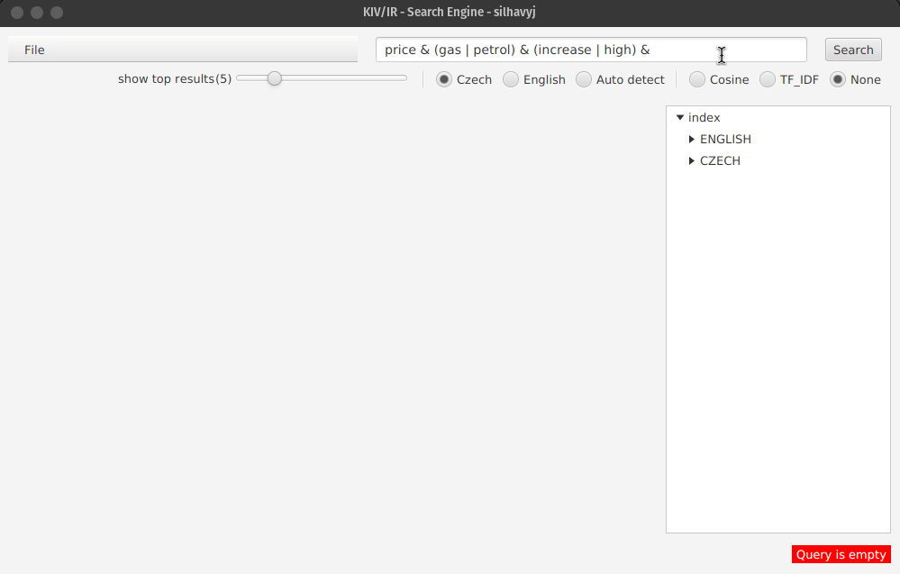
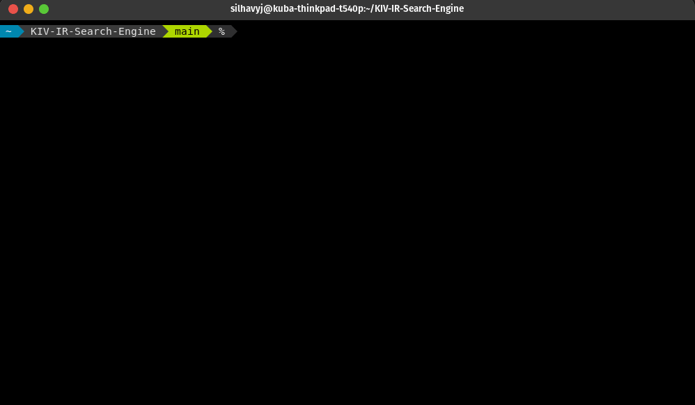
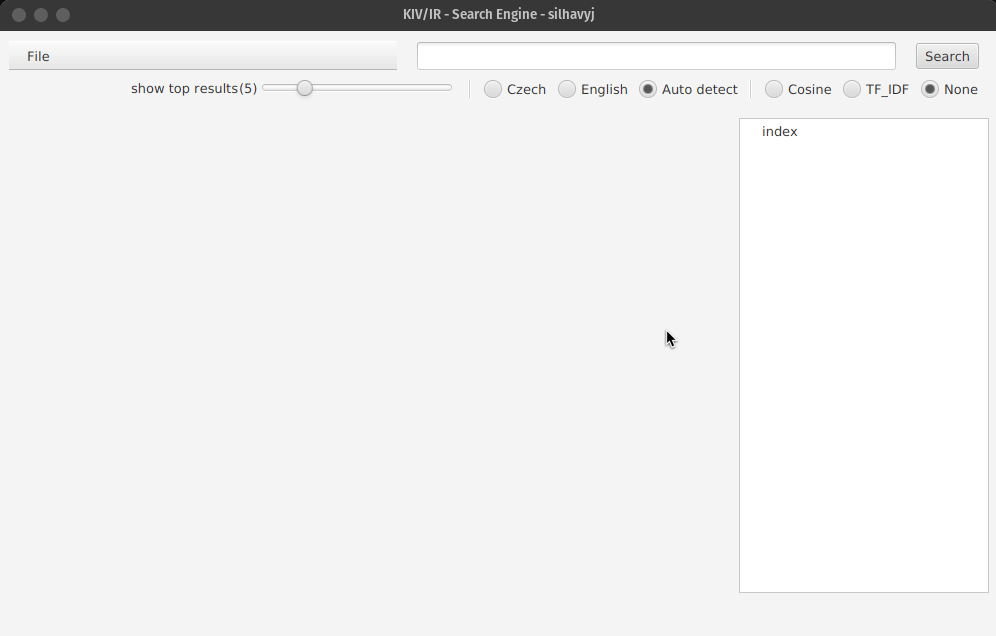
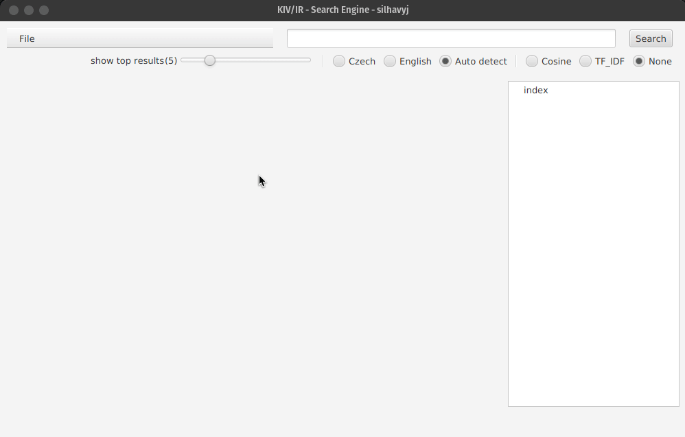

# Search Engine Application

This application represents a simple search engine that was developed as a semester project within the KIV/IR module at the University of West Bohemia. Using a boolean expression, it allows the user to search for specific documents within a given set of documents that was inputted into the application. The results of a search can be sorted either by [cosine similarity](https://en.wikipedia.org/wiki/Cosine_similarity) or [tf-idf](https://en.wikipedia.org/wiki/Tf%E2%80%93idf). It also supports automatic language detection. However, for the sake of simplicity, the user can search for documents only in Czech or English.



## Requirements

In order to successfully run the application, the user is required to have **Java** and **Maven** installed on their computer. During the process of development, the following versions were used.

```                                             
openjdk 11.0.14 2022-01-18
Apache Maven 3.6.3
```

## Running the application

Once you've installed all the requirements, all there is left to do is navigating into the root folder of the project structure and executing the following command.

```
mvn clean javafx:run
```

Maven should automatically download all dependencies that are used by the application. If you are on Linux, Maven, by default, stores all dependencies into `~/.m2`  



## Provided data

In order to use the application, the user needs to have a set of documents that will be inserted into the search engine. Each document needs to have the following JSON structure.

```json
{ 
  "datetime": "2022-02-02T18:08:31.000Z",
  "author": "Pritti Mistry", 
  "title": "Bethany Vincent: How mum tried to escape her murdering ex", 
  "article": "Bethany Vincent and her son, ...",
  "url": "https://www.bbc.com/news/uk-england-lincolnshire-60175235"
}
```

It is worth mentioning that the only obligatory fields are **title** and **article**. The rest is just metadata that will be displayed with each result. Some documents were crawled down beforehand and can be downloaded from [here](https://drive.google.com/drive/folders/1lGohFQETohWDUK9kqwkimeKebN3FLS1G?usp=sharing). The folder contains three zip files, bbc-news, trec-all, trec-separated.

### BBC News

The bbc-news folder holds roughly about 8,500 articles downloaded from https://www.bbc.com/news.

### Trec-all

The trec-all folder came with the assignment as test data. These documents were originally serialized in a binary file, so I took the liberty of converting them into a unified JSON format. This folder contains a fair amount of documents, approximately 86,000. 

### Trec-separated

The trec-separated folder hold the same documents as trec-all. The only different is that it splits them up into suborders of 5,000 documents, so they're easier to move around.

## Importing documents

Through *File -> Add Document*, the user can add documents into the application. They can select as many documents as they want. However, inserting 86,000 documents may take some time, so they're also given the option to stop inserting documents at any point. 



They can see the progress in the bottom right corner as well as on the right side of the application that provides more detailed information, such as what indexes where created, how many tokens there are, etc.

On a computer with the following parameters, it took me somewhere between 10 and 14 minutes to process the entire trec-all folder. The bbc-news folder took about 1-2 minutes to process.

CPU: Intel i7-4710MQ (8) @ 3.500GHz\
GPU: Intel 4th Gen Core Processor\
Memory: 6084MiB / 7638MiB

The user doesn't have to worry about indexing multiple instances of the same document. The application keeps track of all documents, and if it encounters a document that has already been indexed, it will simply skip it.

## Fetching additional documents

Using *File -> Fetch & Add Document*, the user can index addition documents. The documents are supposed to be from https://www.bbc.com/news. If the URL doesn't lead to one of the bbc articles, the request to index it will be discarded.

An example of an article the user may want to try to index could be: https://www.bbc.com/news/uk-wales-60764061



Once an article is fetched, it is stored into a fetched-data folder which is located in the root folder of the project structure.

## Searching documents

### Search options

Before entering a query, the user has several options to further customize the search. They are given the option to choose how many results they want to be presented with. This ranges from 1 up to 20 results. Another option is to choose the language, in which they want to perform the search. They can also leave it up to automatic language detection if they want to. However, it's better to be sure that you're searching in the right index. Lastly, they can set the metrics that will be used to rank the documents matching the query.

### Queries

As required, the query supports AND, OR, and NOT logical operators. These operators are represented as `&`, `|`, and `!`. The user can also use parenthesis to explicitly define priorities. If two words are not separated by any of the operators, e.g. `word1 word2`, they are automatically evaluated as `word1 & word2`.

#### Examples

English queries
```
price & (gas | petrol) & (increase | high) & Northern Ireland
```

```
biden & !trump
```

```
Christmas & !(Omicron | coronavirus)
```

Czech queries

```
pejsek & kočička & !válka & pohádka
```
```
17. & února & 1979
```